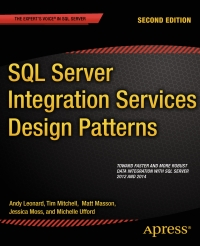

# Apress Source Code

This repository accompanies [*SQL Server Integration Services Design Patterns*](http://www.apress.com/9781484200834) by Tim Mitchell, Matt Masson, Andy Leonard, Jessica Moss, and Michelle Ufford (Apress, 2014).

[comment]: #cover

Download the files as a zip using the green button, or clone the repository to your machine using Git.

## Releases

Release v1.0 corresponds to the code in the published book, without corrections or updates.

## Contributions

See the file Contributing.md for more information on how you can contribute to this repository.
